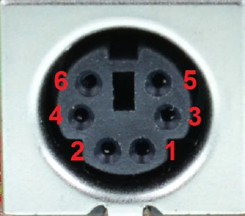

# smartport-arduino
An Arduino sketch that listens to commands from its USB serial interface to perform commands via the SmartPort protocol

## SmartPort pinout

| Pin | Function | Arduino Uno |
|---|---|---|
| 1 | Serial Clock | 13 |
| 2 | MISO | 12 |
| 3 | MOSI | 11 |
| 4 | Frame End | Not Connected |
| 5 | Slave Ready | 8 |
| 6 | Ground | GND |

## Other projects

### https://github.com/stepstools/Rokenbok-Smart-Port-WiFi
Custom ESP32 controller with web interface

### https://github.com/jordan-woyak/rokenbok-smart-port
Arduino controller

### https://github.com/rgill02/rokenbok
Arduino controller with Python client, server, and hub
